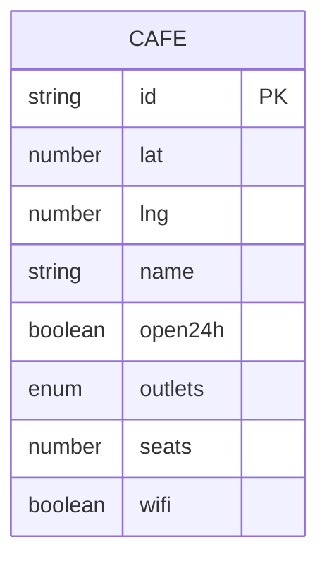

# ERD

## 2.1 현행 엔티티
카공지도 v0.x의 현행 엔티티는 `Cafe` 하나다.
이 엔티티는 보호 시드의 키 집합과 정확히 일치해야 한다.
필드 누락은 데이터 손실이고, 잉여 필드는 검증되지 않은 제품 판단이다.

| 필드 | 타입 | 제약 | 비고 |
|---|---|---|---|
| id | string | PK, `cNN` 형식, 유니크 | 렌더와 즐겨찾기 식별자 |
| lat | number | 위도 | 거리 계산 입력 |
| lng | number | 경도 | 거리 계산 입력 |
| name | string | 비어있지 않음 | 검색 대상 |
| open24h | boolean | true 또는 false | 심야 카공 조건 |
| outlets | enum | `many`, `some`, `few` | 공부적합 점수 입력 |
| seats | number | 양의 정수 | 대형 좌석 임계는 50 이상, 포함 경계 |
| wifi | boolean | true 또는 false | 공부적합 점수 입력 |

## 2.2 파생값
`score(cafe)`는 저장하지 않는다.
콘센트 등급, 와이파이, 24시간 여부를 입력으로 받아 공부적합 점수를 계산한다.
점수는 순수함수로 유지해 UI 렌더와 테스트가 같은 기준을 보게 한다.
`distance(cafe, origin)`도 저장하지 않는다.
거리순 정렬은 기준점 좌표와 카페 좌표에서 haversine으로 계산한다.
홍대입구역 좌표는 앱 코드의 기준점 상수로 관리된다.

## 2.3 관계
서버와 DB가 없으므로 외래키 관계는 없다.
즐겨찾기는 Cafe id 문자열 목록을 localStorage에 저장한다.
localStorage 값은 Cafe 엔티티를 복제하지 않고 id만 보관한다.
이 구조는 정적 번들 범위에서 충분하며 API 전환 전까지 별도 테이블을 만들지 않는다.

## 2.4 Mermaid

## 확장 후보
아래 필드는 현행 필드표에 들어가지 않는다.
검증 없이 시드에 추가하지 않는다.
- `noise` 소음도, 조용함 선호 반영 후보 ‹CONFIRM›
- `price` 가격대, 장시간 체류 비용 후보 ‹CONFIRM›
- `hours` 운영시간 상세, open24h boolean 일반화 후보 ‹CONFIRM›
- `region` 행정동, 동네 단위 탐색 후보 ‹CONFIRM›
